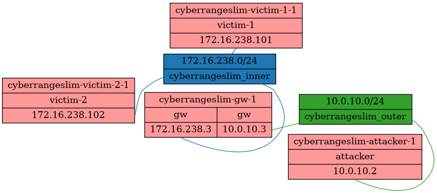

# 基于容器的《网络安全》第一章实验基础模版

[](https://github.com/c4pr1c3/CyberRangeSlim/actions/workflows/docker-ci.yml)

本项目是 [中国传媒大学《网络安全》第一章实验](https://c4pr1c3.github.io/cuc-ns/chap0x01/exp.html)  的基于容器方案的解决方案模版，同学们可以基于当前仓库代码 **继续完善以完全达到作业要求** 。

## 功能清单



* 通过一个独立 `网关` 隔离 2 个 `靶机` 与 1 个 `攻击者主机` 之间的直接连通性。
* 2 个靶机可以直接访问攻击者主机。
* 攻击者主机无法直接访问靶机。
* 网关可以直接访问攻击者主机和靶机。
* 靶机的所有对外上下行流量经过网关。
* 所有节点均可以访问互联网。

## 本项目用到的关键技术

* 构建自定义 `docker` 镜像。 
* 使用 `docker-compose` 编排容器服务和容器网络。

## 快速上手体验

```bash
# 启动服务
bash up.sh

# 停止服务
bash down.sh
```

## 演示

详见 [Github Actions](https://github.com/c4pr1c3/CyberRangeSlim/actions) 的详细构建记录里的 `Test Run` 一节输出日志信息。

## 附录-1：FAQ

1. 执行 `bash test.sh` 报错：`unknown flag: --env-file` 。

建议使用 [Docker 官方安装方法](https://docs.docker.com/engine/install/) ，而不是使用发行版自带的 `apt install docker.io` 方式安装 `Docker` 以确保安装到最新、最完整插件版本的 `Docker` 引擎。可以通过以下指令确认 `docker compose` 子命令是可用的，注意此处不是 `docker-compose` 。

```bash
docker compose --help

# Usage:  docker compose [OPTIONS] COMMAND
# 
# Docker Compose
# 
# Options:
#       --ansi string                Control when to print ANSI control characters
#                                    ("never"|"always"|"auto") (default "auto")
#       --compatibility              Run compose in backward compatibility mode
#       --env-file string            Specify an alternate environment file.
#   -f, --file stringArray           Compose configuration files
#       --profile stringArray        Specify a profile to enable
#       --project-directory string   Specify an alternate working directory
#                                    (default: the path of the, first specified,
#                                    Compose file)
#   -p, --project-name string        Project name
```

## 附录-2：docker-network-graph 子模块使用方法

[项目中的子模块 docker-network-graph](https://github.com/LeoVerto/docker-network-graph) 是一个用于自动化可视化当前主机上容器网络拓扑的一个开源项目。`功能清单` 一节的网络拓扑示意图就是使用该开源项目自动化渲染得到的，请忽略其中的 `host` 和 `bridge` 容器内置网络。

快速使用方法如下：

```bash
# 初始化注册并拉取子模块仓库的所有代码
git submodule update --init --recursive

# 如果没有安装 pipenv ，先安装
pip install -U pip 
pip install pipenv

# 如果没有 Python 3.9 解释器环境，先安装 pyenv
# ref: https://github.com/pyenv/pyenv#installation
# 注意 Kali Rolling 目前默认使用的 Shell 是 Zsh
# 完成 pyenv 安装后，再安装当前可用的 python 3.9 版本
# 【注意】先按照 https://github.com/pyenv/pyenv/wiki#suggested-build-environment 安装依赖 Lib
# 【注意】完成上述依赖 Lib 安装后再执行以下指令
pyenv install 3.9.14
# 如果在下载 Python 源码包时遇到网络错误，可以单独下载源码包
# 然后参考这里的解决方法 https://github.com/pyenv/pyenv/issues/754
# 再通过 pyenv 安装 Python 3.9

# 进入 docker-network-graph 子目录
cd docker-network-graph && pyenv local 3.9.14 && pipenv install

# 安装依赖的二进制工具软件 graphviz
sudo apt update && sudo apt install -y graphviz

# 渲染容器网络图
pipenv run python docker-net-graph.py  | fdp -Tpng -o out.png
```


